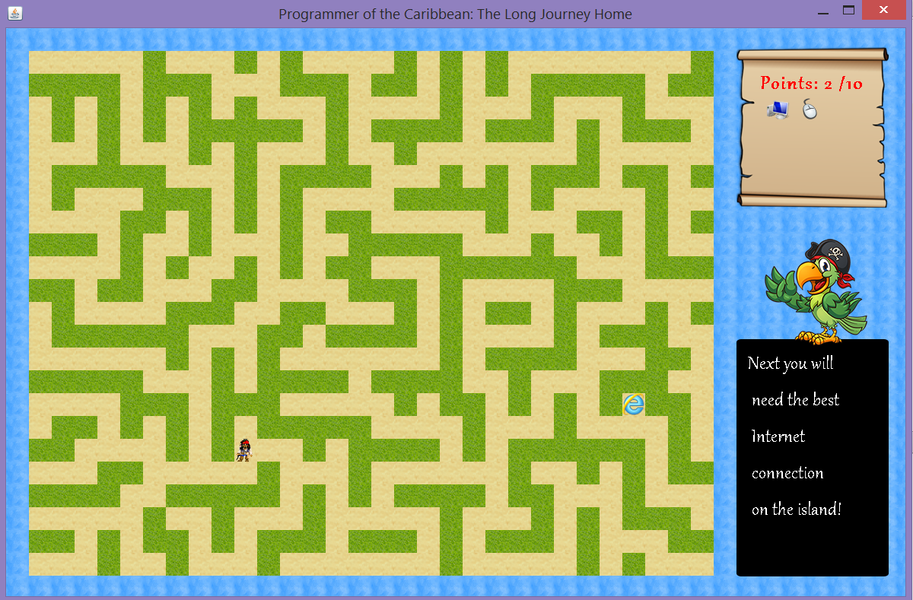
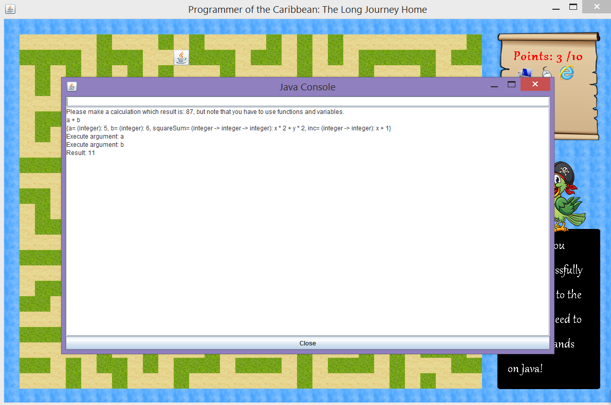

# ThePirateTreasure
 A Pirate game with a simple REPL 
### Version
0.0.1
### Development
The game is separated in two parts: 

* App package - it includes the main functionality of a small REPL. It's possible to define a variable, function or to use the input like a calculator. The implementation is based on the Shunting Yard and the Postfix Algorithm. A simple example for input is:
```sh
$ 1 + 2 / 3 * (a + b)
$ var integer c = 5;
$ def aSum (integer -> integer -> integer) x y = x * 2 + y * 2 
$ a
$ inc(b) + b
$ aSum(inc(a),inc(b))
```

    /Please note that a, b, inc(), squareSum() are predefined/

* Desktop package - includes the main board of the game and a simple Console window. For presentation of the main graphical elements is used Swing & jPanel. 
The implementation of the console is based on ["Simple JAVA Console"]. 
> A screenshot of the maze:


    > A screenshot of the console:


["Simple JAVA Console"]: <http://www.comweb.nl/java/Console/Console.html>